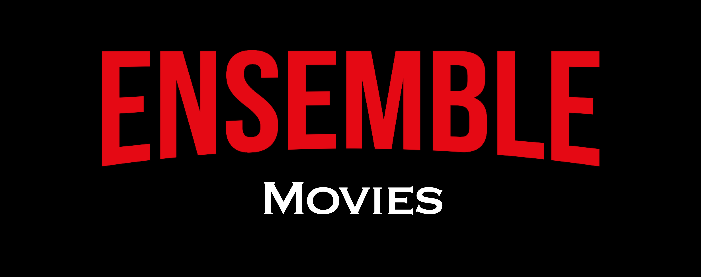
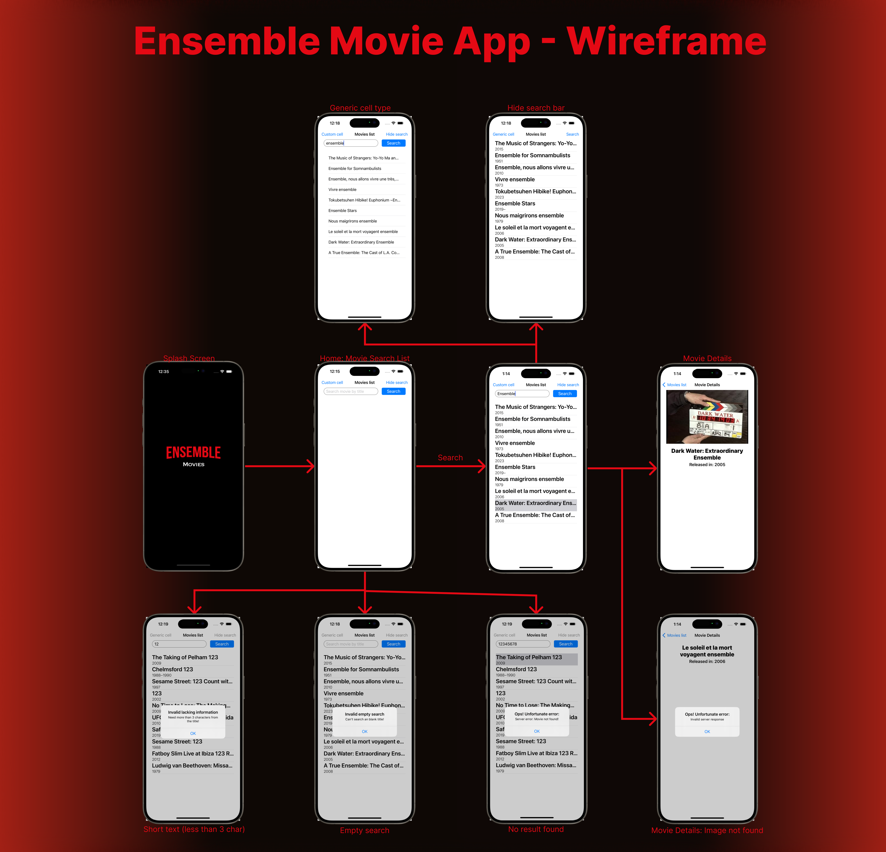

# Ensemble Movies

## Description
An take home iOS project-App for Ensemble interview process to display proficiency with Swift. 
### The project should follow the requirementes: 
- Must include usage of Native iOS (Swift)
- Code must be owned by you or open source
### Technical 
- Search results must come from OMDB API
- Each search result should display poster, title, year of release and a button. Clicking the button should do
nothing
- Updates to the search term should update the result list

### Submission
- Link to repo on GitHub, BitBucket or Gitlab. If you want to keep the repo private, then ask for the
account name that should be added for access
- Link to zip package on Google Drive, Sharepoint, Dropbox or other cloud file sharing service

## About

I choose to start a project from scratch to display how far I could develop in a short amount of time while using well know technologies and tools such as Postman, SPM, SourceTree, Github, etc...
I tried to keep it as complete as possible and do the most features from the backlog I outlined. 

### Overview

The projects main features are the Movie Search List and the Movie Details: 

- In the main feature you can also toggle between simple and detailed list cell
- The search can also be hidden to optimize the list area
- You can also toggle between dark and light mode inside the Movie Detail screen

You can have a quick overview of the userflow in the gif below: 

Here is the wireframe for the entire project:

> Have an ideia for a new feature? [Submit an issue](https://github.com/LucasCBarros/EnsembleMoviesOMDB/UBorrow/issues/new).

### Technical Overview

- Archtecture choosen was MVVM to make it easier to test
- UITest + UnitTests with coverage of 98,5%
- Tests follow Given/When/Then formula to verify the features
- Mocked tests with JSON files retrived via Postman 
- Swift Package for QuickUIKitDevTools (that I created mostly for ViewCodable protocol to organize code and Chained Contraints)
- Error handling
- All views have been programmatically developed
- Project has SwiftLint to keep code standards
- Server request visa URLSessions
- Project uses both DispatchQueue and Async/Await
- Features Dark/Light mode toggle in Movie Detail screen
- You can find all changes made in the CHANGELOG.md

### Future Improvements: 

- Localizable strings
- Remote config for localizable strings
- Remote config for feature flags
- Implement UI testing with snapshot [Link here](https://github.com/uber/ios-snapshot-test-case/)
- Captcha for security (Avoid multiple search requests in short time)
- Loading indicators
- Deeplink into the expected movie
- TvOS (WIP)

## How to run

### Requirements
- Xcode 9.0+

### Getting Started
- Clone this repository
- update Swift Packages
- Open the .xcodeproj and you are good to go.

## Contributing

Feel free to [open an issue](https://github.com/LucasCBarros/EnsembleMoviesOMDB/issues/new) or [submit a pull request](https://github.com/LucasCBarros/EnsembleMoviesOMDB/compare) if you have any improvement or feedback.

### Author

Lucas Barros, LucasCavalcanteDeBarros@gmail.com.
